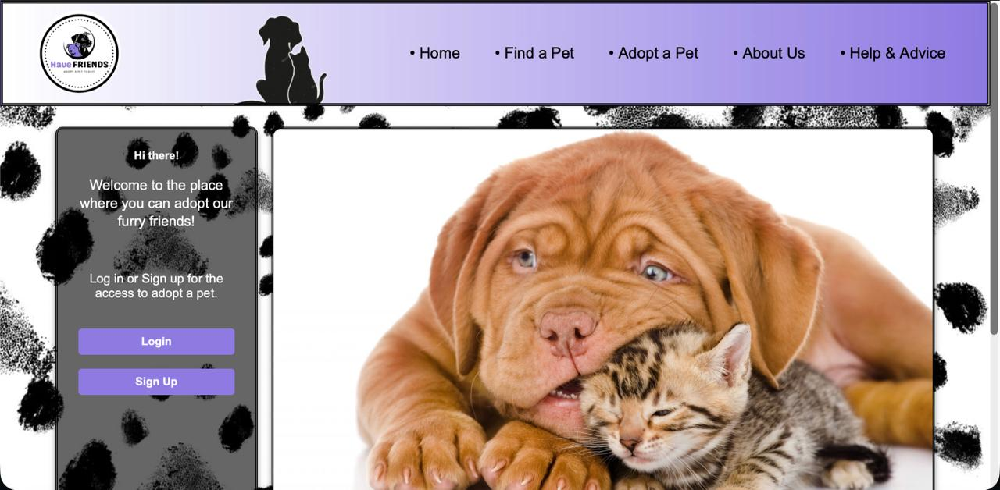
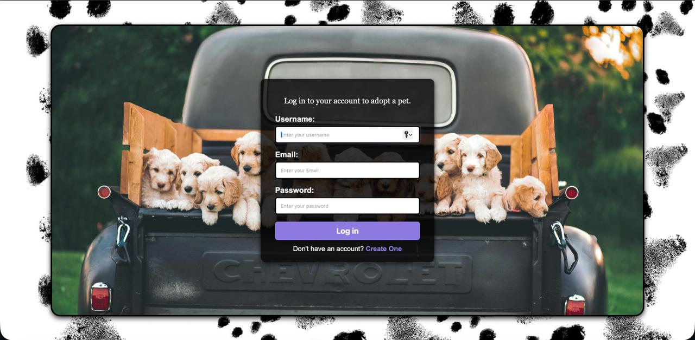
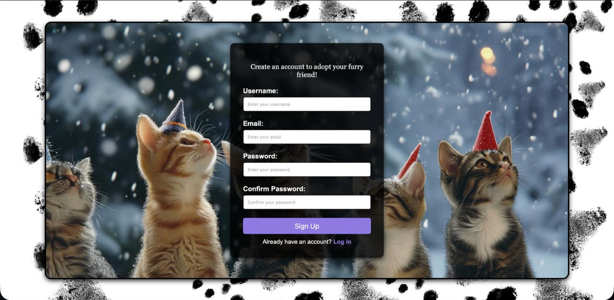
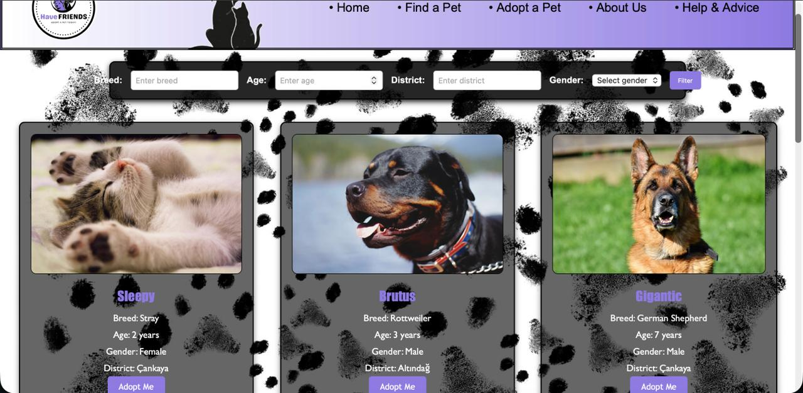

# 🐾 Pet Adoption Platform (Hayvan Sahiplendirme Sitesi)

Bu proje; kullanıcıların evcil hayvan sahiplenebileceği, kendi hayvanlarını sahiplendirebileceği ve hayvan dostlarımız hakkında bilgi edinebileceği dinamik bir web platformudur.

## 🌟 Özellikler

* **Kullanıcı Yönetimi:** Kayıt olma (Sign Up), giriş yapma (Login) ve güvenli çıkış (Logout) sistemleri.
* **Dinamik Sahiplenme:** Bir hayvan sahiplenildiğinde, ilgili veri MySQL veritabanından otomatik olarak silinir ve ana sayfadaki liste anlık olarak güncellenir.
* **Hayvan Rehberi:** Sadece ilanlar değil, aynı zamanda hayvanlar hakkında kısa ve faydalı bilgilerin yer aldığı bölümler.
* **Görsel Katalog:** Sahiplendirilmeyi bekleyen hayvanların fotoğraflarını içeren kullanıcı dostu arayüz.

## 📸 Ekran Görüntüleri

| Ana Sayfa | Giriş Yap (Login) | Kayıt Ol (Sign Up) | Hayvan Detay |
| :---: | :---: | :---: | :---: |
|  |  |  |  |

## 🛠 Teknik Detaylar

* **Frontend:** HTML5, CSS3, JavaScript
* **Backend:** PHP
* **Veritabanı:** MySQL
* **Sunucu:** XAMPP / Localhost

## 🚀 Kurulum ve Çalıştırma

1. Projeyi `git clone` ile bilgisayarınıza indirin.
2. XAMPP üzerinden Apache ve MySQL servislerini başlatın.
3. Proje klasöründeki `.sql` dosyalarını `phpMyAdmin` üzerinden yerel veritabanınıza içe aktarın (Import).
4. Tarayıcınızda `localhost/Ceng361-WebProject/` adresine giderek projeyi çalıştırın.

## 👥 Geliştiriciler

Bu proje aşağıdaki ekip tarafından hazırlanmıştır:

* **Nisa Doğa Yücel** - 220201012
* **Furkan Tuç** - 220205033
